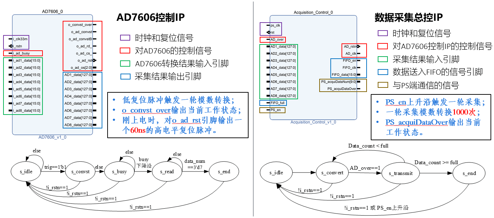
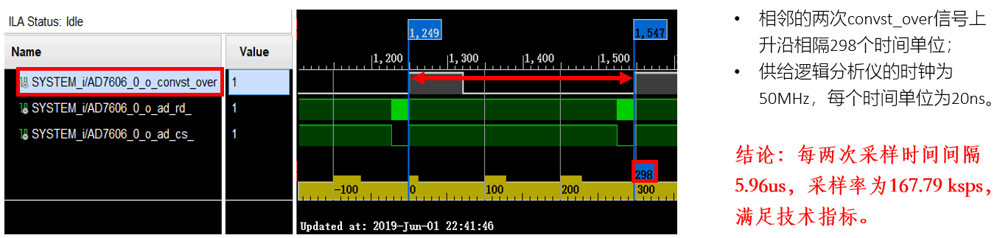

+++
# Project title.
title = "AC Multi-Channel Parallel Acquisition and Processing Circuit based on ZYNQ"

# Date this page was created.
date = 2019-02-20

# Project summary to display on homepage.
summary = "This is the graduation design of my Bachelor's degree."

# Tags: can be used for filtering projects.
# Example: `tags = ["machine-learning", "deep-learning"]`
tags = ["ZYNQ", "FPGA", "Digital circuit design"]

# Optional external URL for project (replaces project detail page).
external_link = ""

# Featured image
# To use, add an image named `featured.jpg/png` to your project's folder. 
[image]
  # Caption (optional)
  #caption = ""

  # Focal point (optional)
  # Options: Smart, Center, TopLeft, Top, TopRight, Left, Right, BottomLeft, Bottom, BottomRight
  focal_point = "Smart"
+++

- Designed and developed a small and easy to carry testing electronic system for electrical load of civil aviation aircraft.

- Designed an embedded circuit board based on ZYNQ to collect and calculate the effective value of multi-channel AC, and to transmit the calculation results to the upper computer which could reduced the calculation load of the upper computer.

- Achieved >100 ksps sampling rate of the single channel and the effective value acquisition error <0.5%, and could provide up to 64 AC parallel acquisition.

The following are some of the results (in Chinese):

