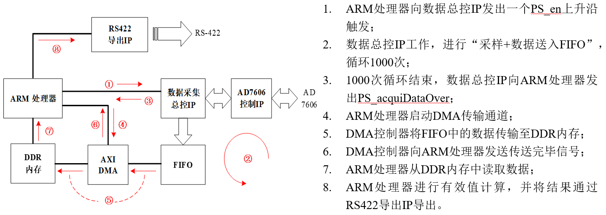

+++
# Project title.
title = "AC Multi-Channel Parallel Acquisition and Processing Circuit based on ZYNQ"

# Date this page was created.
date = 2019-06-20

# Project summary to display on homepage.
summary = "This is the graduation design of my Bachelor's degree."

# Tags: can be used for filtering projects.
# Example: `tags = ["machine-learning", "deep-learning"]`
tags = ["ZYNQ", "FPGA", "Digital circuit design"]

# Optional external URL for project (replaces project detail page).
external_link = ""

# Featured image
# To use, add an image named `featured.jpg/png` to your project's folder. 
[image]
  # Caption (optional)
  #caption = ""

  # Focal point (optional)
  # Options: Smart, Center, TopLeft, Top, TopRight, Left, Right, BottomLeft, Bottom, BottomRight
  focal_point = "Smart"
+++

# Introduction
Among the various electrical parameters of airborne AC, the voltage effective value (rms value) of steady-state AC voltage is an extremely important parameter. There are strict international standards for measuring the effective value of airborne AC. Our project is carried out with reference to the ISO 12384 standard. The main features of airborne AC voltage acquisition task are: 
- Multiple acquisition channels
- High sampling frequency requirements
- strict synchronization requirements 
- Equipment miniaturization requirements

Considering that the complete test system also needs to measure other parameters, which will result in a large computing power load, we want to develop a lower computer circuit to undertake the multi-channel airborne AC rms measurement task to reduce the burden on the upper computer.

# Technical Requirements
- Equipment area is not less than 200 mm × 180 mm, height is not more than 100 mm.
- The sampling rate of the single voltage acquisition channel is not less than 100 ksps, and the sampling time is not more than 1s. The data bit width is not less than 14 bits.
- The voltage rms error does not exceed 0.5%.
- The number of acquisition channels is not less than 64, and the data of all the channels need to be acquired synchronously.
- The processed data is output using the standard RS 422 interface.

# Overall Design
### Hardware Design

The circuit hardware is mainly divided into the following four modules:
- Multi-channel data acquisition module
- ZYNQ core board main control module
- Data export module
- Power supply module

### Software Design
The ZYNQ chip used in this project is a all programmable SoC, which equipped with dual-core ARM Cortex-A9 processors (PS) and Kintex®-7 based programmable logic (PL). We use Verilog language to program PL part to control multiple AD chips to complete the parallel acquisition and data stream transmission task of instantaneous voltage. Use the C language to develop the PS part to complete the calculation of the effective value. The logic of the PL part is packaged into an IP core through the VIVADO software, and the ARM program controls the work of these IPs by reading and writing custom registers. The following figure shows the logical state machine of two IP cores:

The overall operation process of the software is shown in the following figure:

1. The ARM processor sends a PS_en rising edge trigger to the data master IP.
2. The data master IP works, data is sampled and sent into the FIFO, which loop 1000 times.
3. The data master IP sends PS_acquiDataOver to the ARM processor. 
4. The ARM processor starts the DMA transfer channel. 
5. The DMA controller transfers the data in the FIFO to the DDR memory. 
6. The DMA controller sends a signal to the ARM processor that the transfer is complete. 
7. The ARM processor reads data from the DDR memory.
8. The ARM processor performs effective value calculation and exports the result to IP through RS422.

# Product & Test

- Single channel sampling rate is 167.79 ksps.
- The average time for any channel of the board to complete a data acquisition and calculation process is about 6.590 ms.
- The effective value acquisition error does not exceed 0.4%.
- The power consumption of the whole board is about 7.98 W.

-------------------------------

