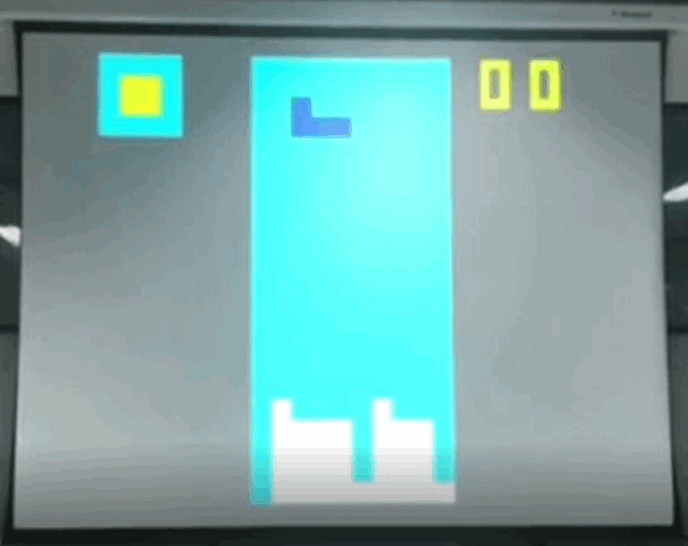
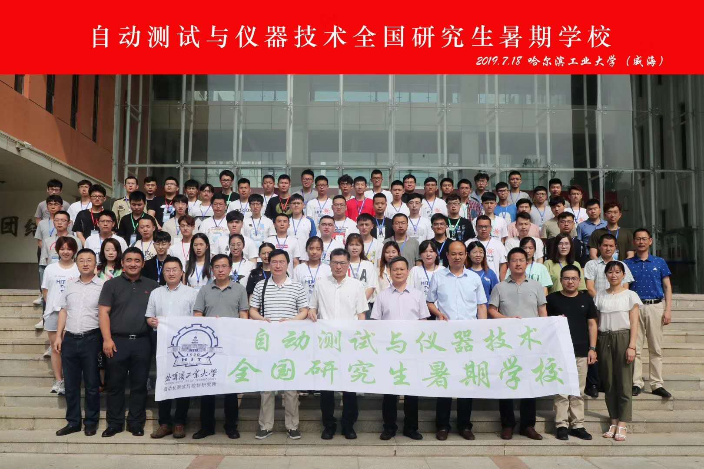

+++
# Project title.
title = "Embedded Tetris game based on FPGA and VGA protocol"

# Date this page was created.
date = 2019-07-20

# Project summary to display on homepage.
summary = "We took part in 2019 summer project of measurement and control in Weihai, China."

# Tags: can be used for filtering projects.
# Example: `tags = ["machine-learning", "deep-learning"]`
tags = ["FPGA", "VGA protocol"]

# Optional external URL for project (replaces project detail page).
external_link = ""

# Featured image
# To use, add an image named `featured.jpg/png` to your project's folder. 
[image]
  # Caption (optional)
  #caption = ""

  # Focal point (optional)
  # Options: Smart, Center, TopLeft, Top, TopRight, Left, Right, BottomLeft, Bottom, BottomRight
  focal_point = "Smart"
+++

# Summer Project of Measurement and Control
    
We took part in 2019 summer project of measurement and control in Weihai, China. See details about [Admission Notice](http://tce.hit.edu.cn/news/1488) 、[News](https://www.hitwh.edu.cn/2019/0715/c1307a110158/page.htm) and [Brochure](https://a.eqxiu.com/s/CEA14EuC?eqrcode=1&share_level=5&from_user=202004275378cf24&from_id=8f96cfe4-c&share_time=1587953016799&from=timeline&isappinstalled=0)。

This year's summer project is held in Weihai, from July 14th to July 26th.  I submitted the registration form on June 25 and received the admission notice on July 4.

# Project

We need to form a team of 3 to 4 people to develop a complete work in a week.  Fortunately, my good friends H. Yan and Z. Piao were at the time, so we successfully formed an efficient team.

The title of the project we selected is "Embedded Tetris game based on FPGA and VGA protocol". We use a Xilinx development board provided by the organizer, using VIVADO software and Verilog language for development. Unlike other software programming, we use FPGA to develop game logic, use five buttons on the development board as input to control the movement and rotation of Tetris, and the output is connected to the display using a VGA bus.  We use the VGA protocol to control the output logic to make the display screen display what we want to display. Our project references [this](https://github.com/rfotino/verilog-tetris) open source project. On the basis of the existing we have added several new functions:
* Display the next Tetris in the upper left corner of the interface.
* Display the current score in the upper right corner of the interface (the original project is to display the score on the development board with a digital tube).
* The opening image is displayed at the beginning of the game, and the ending image is displayed at the end of the game.

Our project can be found on my [Github](https://github.com/ZPinjun/Tetris-base-on-FPGA-VGA) and [CSDN](https://download.csdn.net/download/qq_39065549/12168594).

The difficulty of the work we do is the display of images.  Because VGA controls the three RGB color channels in the form of dot matrix scanning, it is relatively easy to implement regular geometric figures such as squares.  To display the image in hardware language, we must first store the digital image information in RAM, and then send it to the VGA bus according to the mapping relationship during display.  In order to achieve this, we first use the drawing tool to design the image we want to display, and then use Matlab to read the information of the digital image, convert the information of each pixel into a binary number, and then follow a certain order (three channels separate,  The sequence is R>G>B. Each channel is scanned line by line, from top to bottom.). Write it to the .txt file according to the format of the .coe file, and finally change the suffix to .coe to obtain the storage information recognized by VIVADO. Then integrate the module into the project. Before the game starts, first output the image information in the .coe file to the VGA. Note that it must be output strictly in the order set before.

Fortunately, our work was finally rated as an excellent work. The following is a display taken at the time:
(Because github page does not allow loading in iframe, please see this video on: https://youtu.be/lcI1L9hnv10)

